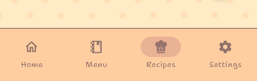
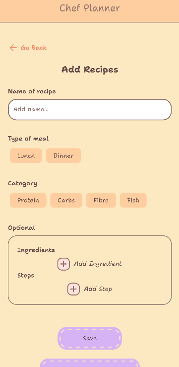
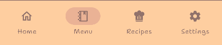
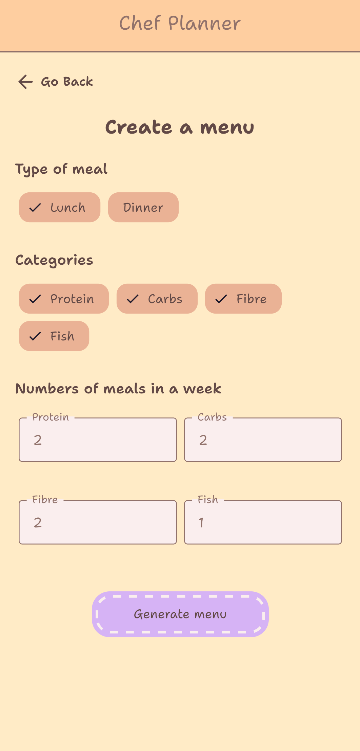
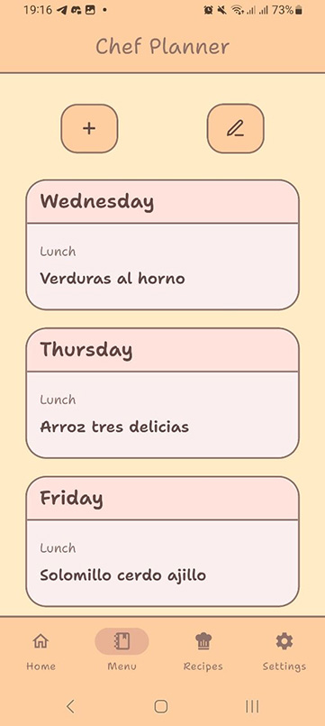

# Chef Planner

Tired of having to come up with meals for tomorrow every day? Me too. This is why this app exists!

## Usage

For the app to work optimally, you need to add recipes first. Navigate to the "Recipes" tab:

And press on the button with the plus sign to add a recipe:

Then, you can fill the pertinent information. Only the name, type and category of meal are required for the app to work. You can also add the ingredients and steps later, by editing the recipe.

Once you've filled the information you can save it, and the app will go back to the Recipes tab. You can also press "Save and add another" to stay in the same screen and keep adding recipes.

Then, once you have enough recipes, you can create a weekly menu by navigating to the Menu tab:

Here you can specify the types of meal you would like the menu to consider as well as the categories and the frequency you want them to appear in the week.

For example, if I wanted to make a weekly menu for my lunchs in which I want to eat protein 2 times a week, carbs also 2 times a week, fibre 2 times a week and fish 1 time in a week, it would be something like this:

In the end, and will we get something like this:

You can create a new menu tapping on the button with the plus sign (on the left), or edit the recipe each day has toggling edit mode with the button with the pencil (on the right).
